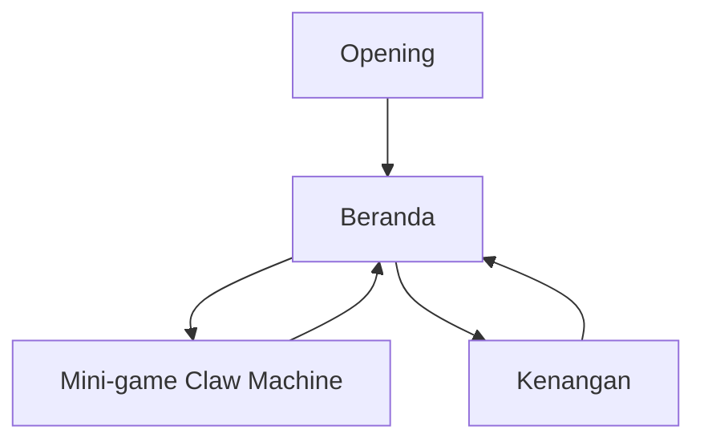

## 1. Product Overview
Website/experience valentine dengan fokus interaksi romantis: mini-game claw machine ambil hati, opening+hero yang lebih kuat, surat interaktif bersuara, music player yang lebih lengkap, dan galeri yang lebih “hidup”.
Targetnya membuat pengalaman singkat namun memorable lewat interaksi, musik, dan momen.

## 2. Core Features

### 2.1 Feature Module
Produk terdiri dari halaman utama berikut:
1. **Beranda**: opening, hero, navigasi utama, music player (upgrade).
2. **Mini-game Claw Machine**: gameplay ambil hati, status permainan, hasil.
3. **Kenangan**: galeri (highlight, timeline toggle, filter, micro-interactions) + amplop & surat dengan sound.

### 2.3 Page Details
| Page Name | Module Name | Feature description |
|---|---|---|
| Beranda | Opening (upgrade) | Menampilkan layar pembuka dengan CTA “Mulai”, transisi masuk yang halus, dan opsi “Skip” bila tersedia. |
| Beranda | Hero (upgrade) | Menampilkan judul utama, subteks singkat, dan CTA utama ke Mini-game serta Kenangan. |
| Beranda | Navigasi | Mengarahkan ke Mini-game dan Kenangan; menandai halaman aktif. |
| Beranda | Music Player (upgrade) | Memutar musik dengan kontrol play/pause, progress/seek, next/prev (playlist), volume/mute, dan menampilkan judul track. |
| Mini-game Claw Machine | Kontrol permainan | Menggerakkan claw (kiri/kanan), menurunkan claw, dan membatasi input saat animasi drop. |
| Mini-game Claw Machine | Logika utama game | Menghasilkan posisi “hati”, mendeteksi tangkapan, dan menentukan status menang/kalah. |
| Mini-game Claw Machine | Status & hasil | Menampilkan indikator status (siap/berjalan/hasil) dan tombol “Main lagi”. |
| Kenangan | Highlight (upgrade) | Menampilkan pilihan foto/slide unggulan sebagai titik masuk eksplorasi. |
| Kenangan | Gallery View + Timeline Toggle (upgrade) | Mengubah tampilan antara grid galeri dan timeline (urut waktu) tanpa reload halaman. |
| Kenangan | Filter (upgrade) | Memfilter item galeri berdasarkan kategori/tag dan/atau rentang waktu yang tersedia. |
| Kenangan | Micro-interactions (upgrade) | Memberi respons halus (hover, focus, transisi, loading state) untuk kartu foto dan kontrol UI. |
| Kenangan | Amplop + Surat (upgrade) | Menampilkan amplop yang bisa diklik untuk membuka surat, dan surat yang bisa dibaca/ditutup. |
| Kenangan | Sound untuk surat | Memutar sound saat amplop dibuka dan/atau surat dibentangkan; menyediakan kontrol mute khusus efek. |

## 3. Core Process
**Alur Pengguna (utama)**
1) Kamu membuka website dan melihat opening.
2) Kamu menekan “Mulai” untuk masuk ke beranda.
3) Dari beranda, kamu bisa menyalakan musik/atur track, lalu memilih:
- **Main Mini-game** untuk “ambil hati”.
- **Buka Kenangan** untuk lihat galeri dan baca surat.
4) Di Kenangan, kamu bisa toggle grid/timeline, memfilter momen, lalu membuka amplop untuk membaca surat dengan sound.

