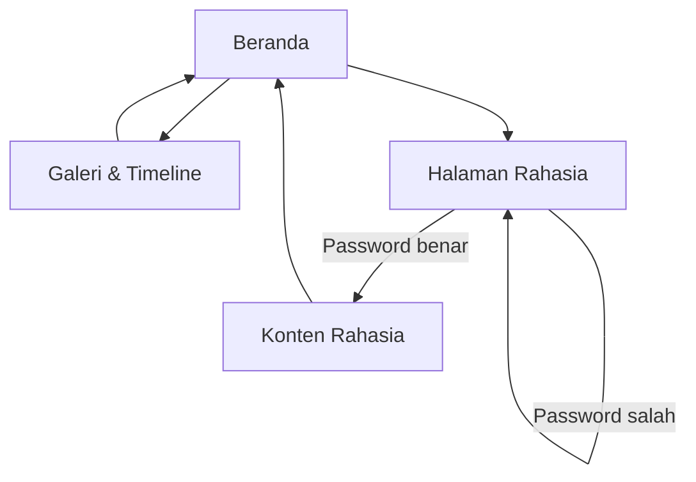

## 1. Product Overview
Website Valentine interaktif untuk pasangan: opening bergaya monitor CRT dengan bintang kelap-kelip, dilanjut amplop & surat digital, lalu kenangan (galeri/timeline) dan kejutan halaman rahasia.
Dirancang untuk 1 pengunjung utama (pasangan), pengalaman romantis, ringan, responsif mobile, dan mudah dibagikan.

## 2. Core Features

### 2.1 User Roles
| Role | Metode Akses | Core Permissions |
|------|-------------|------------------|
| Pengunjung | Buka link | Melihat beranda (opening→amplop→surat→video), musik, countdown, galeri/timeline, ganti tema |
| Pengunjung Terverifikasi | Masukkan password | Mengakses konten rahasia (client-side gate) |

### 2.2 Feature Module
Website Valentine terdiri dari halaman utama berikut:
1. **Beranda**: opening monitor CRT + stars blinking, amplop (klik untuk buka), surat digital, video setelah ucapan selesai, countdown anniversary + “sudah bersama X hari”, musik (widget piring hitam), toggle tema Romantis/Gelap, navigasi ke galeri & rahasia.
2. **Galeri & Timeline**: grid foto, lightbox slider, timeline/kalender otomatis dari metadata foto.
3. **Halaman Rahasia**: form password, status berhasil/gagal, render konten rahasia setelah lolos (opsi “ingat di perangkat ini”).

### 2.3 Page Details
| Page Name | Module Name | Feature description |
|---|---|---|
| Beranda | Opening Monitor | Menampilkan teks romantis bertahap dengan efek CRT/Hertz + stars blinking; lanjut otomatis ke scene amplop; opsi skip (opsional). |
| Beranda | Amplop & Surat | Menampilkan amplop + stempel; membuka surat via klik/tap dengan animasi; merender isi surat dengan tipografi khusus. |
| Beranda | Video Setelah Ucapan | Menampilkan video (Cloudinary) setelah surat/ucapan dianggap selesai dibaca. |
| Beranda | Countdown & Stats | Menghitung countdown anniversary dan “sudah bersama X hari” (acuan 10 Juni 2024 → hari ini). |
| Beranda | Musik & Tema | Memutar musik romantis (audio) dengan cover piring hitam; toggle tema Romantis/Gelap (persist ke localStorage). |
| Beranda | Navigasi | CTA ke “Galeri” dan “Rahasia”. |
| Galeri & Timeline | Gallery Grid | Menampilkan grid foto dari daftar metadata; klik foto membuka lightbox. |
| Galeri & Timeline | Timeline/Kalender | Mengelompokkan foto berdasarkan tanggal (metadata) untuk membentuk timeline/kalender; klik item memfokuskan foto terkait. |
| Galeri & Timeline | Lightbox Slider | Menampilkan foto besar dengan prev/next, caption, tanggal, dan close. |
| Halaman Rahasia | Password Gate | Memvalidasi password di client; menampilkan error jika salah; menyimpan status lolos (opsional “ingat perangkat”). |
| Halaman Rahasia | Konten Rahasia | Menampilkan konten kejutan hanya jika password benar; tombol kembali ke beranda. |

## 3. Core Process
Alur Pengunjung:
1) Membuka link → beranda memulai **opening monitor** (CRT + bintang kelap-kelip + teks). 2) Opening selesai → tampil **amplop tertutup**. 3) Klik/tap amplop → animasi terbuka → **surat tampil**. 4) Setelah ucapan selesai → **video** muncul. 5) Pengunjung dapat membuka **galeri/timeline** atau mencoba **halaman rahasia**.

Catatan keamanan: password gate hanya untuk “kejutan pengalaman”, bukan proteksi serius; jangan taruh data sensitif di konten rahasia.

