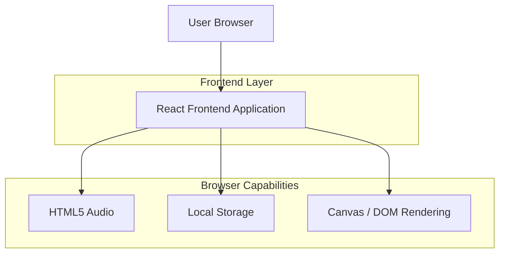

## 1.Architecture design

## 2.Technology Description
- Frontend: React@18 + TypeScript + vite
- Styling: tailwindcss@3 (atau CSS Modules bila sudah ada)
- Backend: None (konten/asset bersifat statis)

## 3.Route definitions
| Route | Purpose |
|---|---|
| / | Opening + Beranda (hero, navigasi, music player) |
| /game | Mini-game claw machine ambil hati |
| /kenangan | Galeri (highlight, timeline toggle, filter) + amplop & surat bersuara |
| /secret | Halaman surprise/rahasia (password gate atau unlock dari mini-game) |

## 4.Client-side persistence (Local Storage)
- Preferensi: tema, mode vintage.
- Mini-game: total menang, high score, dan status unlock rahasia.
- Anniversary: flag “sudah dirayakan” per-tahun untuk mencegah trigger berulang.

## 5.Time-based automation
- Anniversary mode dipicu saat local time memasuki 00:00 pada tanggal anniversary (berdasarkan RELATIONSHIP_START_ISO).
- Saat terpenuhi: tampilkan overlay gelap + fireworks/confetti, lakukan music fade-in, lalu redirect ke /secret.

## 6.Audio
- HTMLAudioElement untuk background music slideshow dan anniversary (fade-in/fade-out).
- Web Audio API untuk SFX kecil (drop/success) agar tidak butuh asset tambahan.
