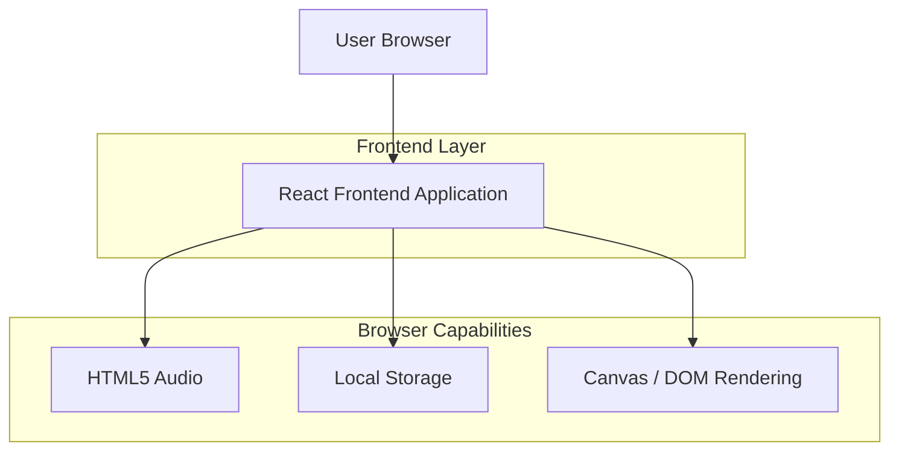

## 1.Architecture design

## 2.Technology Description
- Frontend: React@18 + TypeScript + vite
- Styling: tailwindcss@3 (atau CSS Modules bila sudah ada)
- Backend: None (konten/asset bersifat statis)

## 3.Route definitions
| Route | Purpose |
|---|---|
| / | Opening + Beranda (hero, navigasi, music player) |
| /game | Mini-game claw machine ambil hati |
| /kenangan | Galeri (highlight, timeline toggle, filter) + amplop & surat bersuara |
