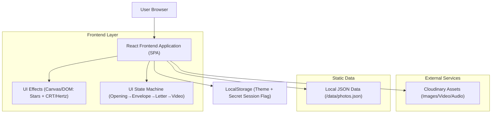

## 1.Architecture design

Aplikasi berupa SPA statis (tanpa backend). Semua interaksi berjalan di browser: efek visual (stars + CRT), state flow (opening→amplop→surat→video), serta halaman galeri & rahasia.

## 2.Technology Description

* Frontend: React\@18 + vite + react-router-dom\@7

* Styling: CSS (vanilla/CSS Modules) + design tokens (tema Romantis/Gelap)

* Backend: None

## 3.Route definitions

| Route    | Purpose                                                               |
| -------- | --------------------------------------------------------------------- |
| /        | Beranda: opening CRT + amplop/surat + video + countdown + musik + CTA |
| /gallery | Galeri & timeline/kalender dari metadata foto + lightbox              |
| /secret  | Password gate + render konten rahasia setelah lolos                   |

## 4.Data handling (frontend-only)

* Sumber foto/timeline: file statis `/data/photos.json` berisi `id`, `imageUrl`, `caption`, `takenAt`, `order`.

* Asset media: URL Cloudinary untuk gambar/video/audio.

* Keamanan: password gate client-side (bukan proteksi serius); jangan simpan data sensitif di konten rahasia.
